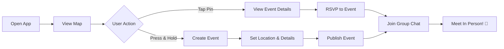

# 🎉 Social Circle

<div align="center">


**Make Real Friends. Meet In Person.**

[](https://reactnative.dev/)
[](https://expo.dev/)
[](https://firebase.google.com/)
[](LICENSE)

A mobile app for adults (21–40+) to create and join **short-term, in-person social events** through an interactive map-based experience.

**Not a dating app.** Casual, interest-based, time-limited connections. Think _"Snap Map meets Meetup"_ — fast, spontaneous, and hyperlocal.

[Features](#-features) • [Screenshots](#-screenshots) • [Tech Stack](#-tech-stack) • [Getting Started](#-getting-started) • [Documentation](#-documentation)

</div>

---

## 🌟 Features

### 🗺️ **Map-First Discovery**

- **Press & hold** anywhere on the map to create an event at that location
- **Tap event pins** to view details and RSVP instantly
- **Category filters** to find events matching your interests
- **Custom dark mode** map styling for night-time browsing

### 📅 **Time-Limited Events**

- Events last 3–7 days, keeping the experience fresh and spontaneous
- **Automatic archiving** after events end
- **Capacity limits** with waitlist support
- **RSVP confirmations** with real-time updates

### 💬 **Built-In Group Chat**

- Auto-generated chat for every event
- Chat activates when first person RSVPs
- Host controls (kick users, close RSVPs, manage participants)
- Share photos, details, and coordinate meetup logistics

### 👥 **Social & Discovery Feed**

- Interest-based event recommendations
- See what friends are attending
- Trending events in your area
- Filter by category: Sports, Food & Drink, Arts, Outdoors, Networking, and more

### 🛡️ **Trust & Safety**

- User ratings (1-5 stars) for hosts and attendees
- Report system for inappropriate content
- Profile verification (email/phone)
- Host moderation tools

### 🌙 **Full Dark Mode**

- System-wide dark theme support
- Custom dark map styling
- Persistent user preference
- Optimized for OLED displays

---

## � Screenshots

<div align="center">

| Map View                | Event Discovery   | Event Details     | Group Chat        |
| ----------------------- | ----------------- | ----------------- | ----------------- |
| 🗺️ Pin-based navigation | �📱 Interest feed | 🎫 RSVP & details | 💬 Real-time chat |

</div>

> _Screenshots coming soon_

---

## 🛠️ Tech Stack

<table>
<tr>
<td>

**Frontend**

- ⚛️ React Native (Expo 50)
- 🎨 Custom theming system
- 📱 iOS & Android support
- 🌙 Full dark mode

</td>
<td>

**Backend**

- 🔥 Firebase Firestore (database)
- 🔐 Firebase Auth (email/phone)
- 📦 Firebase Storage (images)
- ☁️ Cloud Functions (optional)

</td>
</tr>
<tr>
<td>

**State & Data**

- 🐻 Zustand (state management)
- 💾 AsyncStorage (persistence)
- 🔄 Real-time listeners
- 📊 Optimistic updates

</td>
<td>

**Mapping & Location**

- 🗺️ Google Maps API
- 📍 Geolocation services
- 🎨 Custom map styling
- 📌 Interactive markers

</td>
</tr>
</table>

**Additional Tools:** Expo Image Picker, Expo Blur, React Navigation, Firebase Analytics

---

## 🚀 Getting Started

### Prerequisites

Before you begin, ensure you have:

- **Node.js** 18+ ([Download](https://nodejs.org/))
- **npm** or **yarn**
- **Expo CLI** (`npm install -g expo-cli`)
- **iOS Simulator** (Mac only) or **Android Emulator**
- **Firebase project** with Firestore, Auth, and Storage enabled
- **Google Maps API key** with Maps SDK enabled

### Installation

1️⃣ **Clone the repository**

```bash
git clone https://github.com/yourusername/social-circle.git
cd social-circle
```

2️⃣ **Install dependencies**

```bash
npm install
```

3️⃣ **Install iOS pods** (Mac only)

```bash
npx pod-install ios
```

4️⃣ **Set up environment variables**

Create a `.env` file in the project root:

```env
# Google Maps
GOOGLE_MAPS_API_KEY=your_google_maps_api_key_here

# Firebase (if not using config file)
FIREBASE_API_KEY=your_firebase_api_key
FIREBASE_AUTH_DOMAIN=your_project.firebaseapp.com
FIREBASE_PROJECT_ID=your_project_id
```

5️⃣ **Add Firebase config files**

- **iOS:** Place `GoogleService-Info.plist` in `/ios/SocialCircle/`
- **Android:** Place `google-services.json` in `/android/app/`

6️⃣ **Start the development server**

```bash
npm start
```

Then press:

- `i` for iOS simulator
- `a` for Android emulator
- Scan QR code with Expo Go app for physical device

---

## 🏗️ Project Structure

```
social-circle/
├── src/
│   ├── components/          # Reusable UI components
│   │   ├── ui/             # Base components (Button, Card, Input)
│   │   └── themed/         # Dark mode themed components
│   ├── config/             # App configuration & constants
│   ├── features/           # Feature modules (organized by domain)
│   │   ├── auth/          # Authentication & onboarding
│   │   ├── events/        # Event creation, discovery, chat
│   │   ├── interestPosts/ # Interest-based social posts
│   │   └── profile/       # User profiles & settings
│   ├── firebase/          # Firebase config & helpers
│   ├── lib/               # Utilities, analytics, error handling
│   ├── navigation/        # Navigation setup (tabs, stacks)
│   ├── services/          # Business logic & API services
│   ├── store/             # Zustand stores (state management)
│   ├── theme/             # Theme system (light/dark)
│   └── utils/             # Helper functions
├── assets/                 # Images, fonts, icons
├── ios/                    # iOS native code
├── android/                # Android native code (if ejected)
├── functions/              # Firebase Cloud Functions (optional)
├── docs/                   # Documentation
│   └── DARK_MODE.md       # Dark mode implementation guide
└── .github/
    └── instructions/       # AI coding assistant guidelines
```

---

## 🎯 Core User Flow



1. **Discover** — Browse events on the map or discovery feed
2. **RSVP** — Join events with one tap (capacity permitting)
3. **Chat** — Coordinate with attendees in group chat
4. **Meet** — Show up and make real friends!

---

## 📱 Main Screens

| Screen                | Description                               | Key Features                                                   |
| --------------------- | ----------------------------------------- | -------------------------------------------------------------- |
| **🗺️ Map**            | Home screen with interactive map          | Create events (press & hold), browse pins, filter by category  |
| **🔍 Discover**       | Interest-based event feed                 | Trending events, friend activity, personalized recommendations |
| **👥 My Circle**      | Your events & social activity             | Hosted events, attending events, friends list                  |
| **👤 Profile**        | User profile & settings                   | Edit bio, manage interests, ratings, dark mode toggle          |
| **💬 Event Chat**     | Group chat for event attendees            | Real-time messaging, host controls, participant list           |
| **📝 Interest Posts** | Share interests & find like-minded people | Create posts, comment, discover communities                    |

---

## 🔐 Authentication & Onboarding

**Sign Up Flow:**

1. Email/password or phone authentication
2. Name, date of birth, gender
3. Profile photo upload
4. Interest selection (choose from 100+ interests)
5. Location permissions

**Security:**

- Firebase Auth with email verification
- Optional phone number verification
- Secure password requirements
- Session management with token refresh

---

## 🗺️ Event Lifecycle

```
┌─────────────────────────────────────────────────┐
│ 1. CREATE                                       │
│    • Host selects location on map              │
│    • Sets title, description, category         │
│    • Defines capacity & date/time              │
└─────────────────────────────────────────────────┘
                      ↓
┌─────────────────────────────────────────────────┐
│ 2. DISCOVERY                                    │
│    • Event appears as pin on map               │
│    • Listed in discovery feed                  │
│    • Searchable by interests/category          │
└─────────────────────────────────────────────────┘
                      ↓
┌─────────────────────────────────────────────────┐
│ 3. RSVP                                         │
│    • Users join (if capacity available)        │
│    • Group chat auto-created on first RSVP     │
│    • Notifications sent to attendees           │
└─────────────────────────────────────────────────┘
                      ↓
┌─────────────────────────────────────────────────┐
│ 4. EVENT OCCURS                                 │
│    • Attendees coordinate via chat             │
│    • Host manages participants                 │
│    • Location shared in chat                   │
└─────────────────────────────────────────────────┘
                      ↓
┌─────────────────────────────────────────────────┐
│ 5. POST-EVENT                                   │
│    • Event auto-archives after end time        │
│    • Users can rate host & attendees           │
│    • Chat remains accessible for 7 days        │
└─────────────────────────────────────────────────┘
```

---

## 🌙 Dark Mode

Social Circle includes **full dark mode support** across the entire app.

**Features:**

- ✅ System-wide theming (light & dark)
- ✅ Custom dark map style
- ✅ Persistent user preference
- ✅ Automatic StatusBar adjustments
- ✅ Theme-aware components

**Quick Implementation:**

```javascript
import { ThemedScreen, ThemedText } from './components/themed/ThemedComponents';

export default function MyScreen() {
  return (
    <ThemedScreen>
      <ThemedText variant='h1'>Automatically themed!</ThemedText>
    </ThemedScreen>
  );
}
```

📖 **Complete Guide:** [`docs/DARK_MODE.md`](./docs/DARK_MODE.md)

---

## 🧪 Testing

```bash
# Run all tests
npm test

# Run specific test file
npm test -- errorReporting.test.js

# Watch mode for development
npm test -- --watch

# Coverage report
npm test -- --coverage
```

**Test Coverage:**

- ✅ Error reporting utilities
- ✅ Event joining logic
- ✅ Cache management (TTL)
- ✅ Store persistence (Zustand)
- ⏳ More tests in progress

---

## 🚢 Deployment

### iOS (TestFlight)

```bash
# Prerequisites: EAS CLI installed, Apple Developer account configured
eas build --platform ios --profile production
eas submit --platform ios
```

📋 **Checklist:** [`TESTFLIGHT_CHECKLIST.md`](./TESTFLIGHT_CHECKLIST.md)

### Android (Google Play)

```bash
# Prerequisites: EAS CLI installed, Google Play Developer account
eas build --platform android --profile production
eas submit --platform android
```

### Environment Profiles

- `development` — Local testing
- `preview` — Internal testing builds
- `production` — App Store/Play Store builds

---

## 📚 Documentation

| Document                                               | Description                             |
| ------------------------------------------------------ | --------------------------------------- |
| [`docs/DARK_MODE.md`](./docs/DARK_MODE.md)             | Complete dark mode implementation guide |
| [`TESTFLIGHT_CHECKLIST.md`](./TESTFLIGHT_CHECKLIST.md) | iOS deployment checklist                |
| [`.github/instructions/`](./.github/instructions/)     | AI coding assistant guidelines          |

---

## 🤝 Contributing

We welcome contributions! Here's how to get started:

1. **Fork the repository**
2. **Create a feature branch** (`git checkout -b feature/amazing-feature`)
3. **Follow our code style:**
   - Use functional components with hooks
   - Implement dark mode support (use `createStyles(theme)` pattern)
   - Extract reusable components
   - Write tests for new features
4. **Commit your changes** (`git commit -m 'Add amazing feature'`)
5. **Push to the branch** (`git push origin feature/amazing-feature`)
6. **Open a Pull Request**

### Code Guidelines

- **State Management:** Use Zustand for global state
- **Styling:** Use `createStyles(theme)` for dark mode compatibility
- **Firebase:** Always check for soft deletes (`isDeleted !== true`)
- **Performance:** Batch Firestore reads (max 30 IDs per `where('__name__', 'in', ...)`)
- **Accessibility:** Add labels and roles to interactive elements
- **UI/UX:** Keep user flows fast (3 taps or less to RSVP)

---

## 🐛 Troubleshooting

<details>
<summary><b>Metro bundler not starting</b></summary>

```bash
npm start -- --reset-cache
```

</details>

<details>
<summary><b>iOS build fails</b></summary>

```bash
# Clean build artifacts
npm run clean:ios

# Reinstall pods
npx pod-install ios

# Try building again
npm run ios
```

</details>

<details>
<summary><b>Firebase not connecting</b></summary>

1. Verify `.env` file exists and contains `GOOGLE_MAPS_API_KEY`
2. Check Firebase config in `src/firebase/config.js`
3. Ensure `GoogleService-Info.plist` is in `ios/SocialCircle/` folder
4. For Android, check `google-services.json` in `android/app/`
</details>

<details>
<summary><b>Dark mode not working</b></summary>

See the troubleshooting section in [`docs/DARK_MODE.md`](./docs/DARK_MODE.md#-troubleshooting)

</details>

<details>
<summary><b>Map not displaying</b></summary>

1. Verify `GOOGLE_MAPS_API_KEY` in `.env`
2. Check API key has Maps SDK enabled in Google Cloud Console
3. Ensure billing is enabled for your Google Cloud project
</details>

---

## 📄 License

This project is licensed under the **MIT License** - see the [LICENSE](LICENSE) file for details.

---

## � Acknowledgments

- **Expo Team** for the amazing React Native framework
- **Firebase** for backend infrastructure
- **Google Maps** for mapping services
- **Community** for feedback and contributions

---

## 📧 Contact & Support

- **Issues:** [GitHub Issues](https://github.com/yourusername/social-circle/issues)
- **Discussions:** [GitHub Discussions](https://github.com/yourusername/social-circle/discussions)

---

<div align="center">

**Built with ❤️ for real-world friendships**

[⬆ Back to Top](#-social-circle)

</div>
